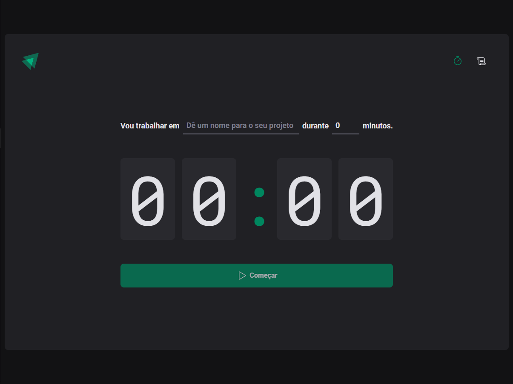
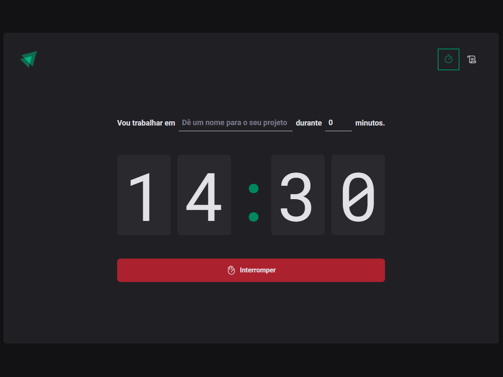
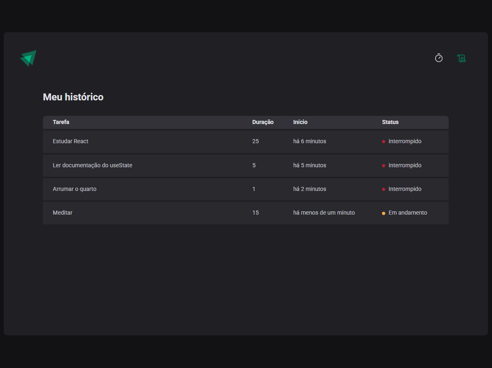

# Ignite Timer

This was the project developed in level 02 of Rocketseat's React course.

## [View the project here](https://ignitetimer-lime.vercel.app/) ##

## Table of contents

- [Overview](#overview)
  - [Screenshots](#screenshots)
- [How to Run the Project](#how-to-run-the-project)
- [Developed with](#developed-with)
- [Author](#author)

## Overview

This project is a timer where you can enter the task or project you’ll be working on and start the countdown. You also have access to a task history that shows what you worked on, how long it took, and whether it was completed, interrupted, or is still in progress.
### Screenshots

#### Desktop design

### Initial State


### Active State


### History page


## How to Run the Project

To run the project locally, follow these steps:

1. Clone the repository:
   ```bash
   git clone "https://github.com/itsdavss/ignite-timer"

2. Navigate to the project folder:
   ```bash
   cd ignite-timer

3. Install the dependencies:
   ```bash
   npm install

4. Start the development server:
   ```bash
   npm run dev

## Developed with

- Typescript 
- React
- Styled Components
- Contexts
- React Router DOM
- React Hook Form
- Zod
- Immer

## Author

- GitHub - [itsdavss](https://github.com/itsdavss)
- My portfolio - [Davi Oliveira](https://itsdavss.github.io/portfolio-davi/)
